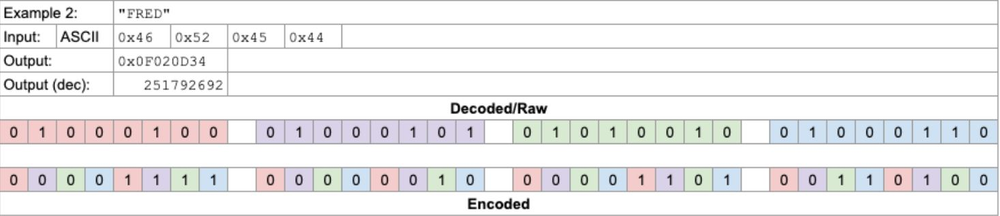

# Weird Encoder

This is a Flask application to encode and decode the given text.

Encoding Logic:

Follow the color coding of the bits in the image to understand the encoding logic.

## Installation Steps:

Install Virtual Env:

    pip install virtualenv
    
Test your installation:

    virtualenv --version

Switch to Virtual Environment:

    virtualenv venv

Activate the virtual environment:
    
* On macOS and Linux:

        source env/bin/activate
* On Windows:
    
        .\env\Scripts\activate

Install all the necessary packages:

    pip install -r requirements.txt

Confirm all the packages have been installed:

    pip freeze

## Run the application:

Run the application in you virtual environment:

    python app.py

The application would start running on localhost and would provide you with the URL. Now open browser and hit the URL to access the application.

    Running on http://127.0.0.1:5000/

